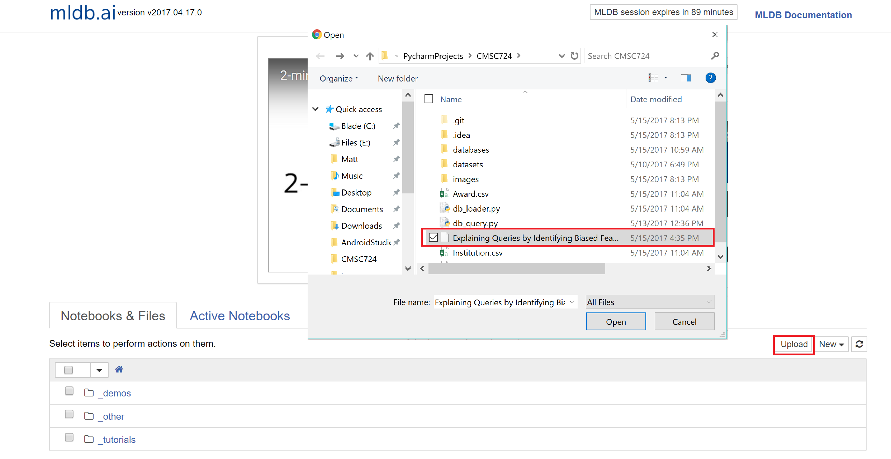

# Query Explainability - Identifying Biased Features in AI & ML Models
 
This project explores "explainability" of AI models, which is useful for ensuring that AI models are not making decisions based on irrelevant or otherwise unfair criteria. Specifically this project focuses on identifying biased features to correctly identify correlated attributes, which are useful in explaining unexpected query answers. These techniques can be applied to incorporate automatic attribute selection into explainable databases by exploiting primary & foriegn key relationships, knowledge about aggregate operators, and minimal human domain knowledge.
 
 We implemented our code using Python and Machine Learning Database (MLDB). We used the NSF dataset which is available here: https://www.nsf.gov/awardsearch/download.jsp

 The Python scripts in this repository handle the parsing of the XML records, loading them into the database, and exporting them to CSV.

 The majority of our Machine Learning code is contained within "Explaining Queries by Identifying Biased Features.ipynb" which is a Python notebook that uses MLDB. To run the notebook you need to create a free account at https://mldb.ai/

 Make sure to verify your email in order to run the code successfully. Once you have an account you can launch a session:

Once the session is launched you can upload the notebook contained in our repository:

The notebook contains code as well as markdown text describing our methods. You can step through each block by pressing `Shift + Enter` on the keyboard.
